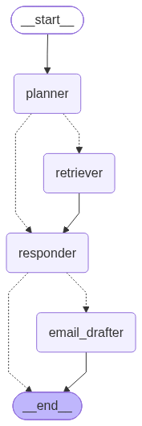

# Customer Agent — assistant pour les comptes clients

Une équipe commerciale se connecte et pose des questions sur **un** compte client :
*« Qu'a dit le client sur le prix ? »*, *« Où en est la contestation de facture ? »*,
*« Écris un email de relance à Hélène. »*

- Les réponses viennent **uniquement** des appels et des emails de ce compte.
- Chaque réponse **cite ses sources** `[1]`, `[2]`, et chaque source ouvre l'appel ou l'email complet.
- L'assistant **se souvient de la conversation** (on peut poser des questions de relance).
- Un email rédigé par l'assistant **n'est jamais envoyé** sans l'accord d'un humain.

Stack : LangGraph · MCP (FastMCP) · FastAPI · MongoDB · Streamlit · Azure Container Apps.
Modèles : Gemma 4 31B sur Lightning AI (chat), Voyage AI `voyage-4-large` (embeddings).

Documentation : [architecture et décisions techniques](docs/ARCHITECTURE.md) · [conception du déploiement Azure](docs/DEPLOIEMENT.md)

---

## 1. L'architecture en une image

```
  Navigateur
      │
      ▼
  ┌───────────┐ /login, /chat ┌───────────────────┐ outils MCP  ┌────────────┐
  │    ui     │ ────────────► │        api        │ ──────────► │ mcp_server │
  │ Streamlit │ /actions ...  │ FastAPI           │ + token JWT │ FastMCP    │
  └───────────┘               │ + agent LangGraph │             └─────┬──────┘
                              └──┬─────────────┬──┘                   │
                                 │             │                      │
                                 ▼             ▼                      │
                          LLM (Lightning)   MongoDB ◄─────────────────┘
                                               ▲
                                               │
                                           ingestion

  Voyage AI (embeddings) est appelé par mcp_server (questions) et ingestion (documents).
```

**Une seule image Docker**, lancée avec une commande différente pour chaque service :

| Service    | Dossier                 | Commande de démarrage                               | Port |
|------------|-------------------------|-----------------------------------------------------|------|
| ui         | `ui/`                   | `streamlit run ui/streamlit_app.py`                 | 8501 |
| api        | `api/` + `agent/`       | `uvicorn api.main:app --port 8000`                  | 8000 |
| mcp        | `mcp_server/`           | `python -m mcp_server.server`                       | 8001 |
| ingestion  | `ingestion/`            | `python -m ingestion.ingest data/accounts`          | —    |

> L'agent LangGraph n'a **pas** de serveur à lui : c'est une bibliothèque Python que
> l'API appelle dans `POST /chat`. Il tourne donc **dans** le conteneur `api`.

---

## 2. L'arborescence

```
customer-agent/
│
├── shared/                  CODE COMMUN (utilisé par tous les services)
│   ├── config.py            les réglages (lus dans les variables d'environnement / .env)
│   ├── database.py          connexion MongoDB + création des index
│   ├── search.py            les 4 requêtes de lecture (mots-clés, sens, récents, un document)
│   ├── security.py          mots de passe + tokens JWT
│   ├── embeddings.py        appel à Voyage AI (texte -> vecteur)
│   └── guards.py            garde-fous contre l'injection de prompt
│
├── ingestion/               CHARGER LES DONNÉES          (Azure : Job "ingest")
│   ├── chunking.py          découper un long texte en morceaux
│   └── ingest.py            fichiers JSON -> interactions + chunks + embeddings
│
├── mcp_server/              LES OUTILS DE RECHERCHE      (Azure : Container App "mcp")
│   └── server.py            4 outils MCP, le compte est lu dans le token
│
├── agent/                   L'AGENT LANGGRAPH            (tourne dans le Container App "api")
│   ├── state.py             l'état du graphe + Plan + EmailDraft
│   ├── prompts.py           tous les prompts envoyés au LLM
│   ├── llm.py               le client LLM (API compatible OpenAI)
│   ├── mcp_client.py        appelle les outils du serveur MCP, en parallèle
│   ├── graph.py             assemble les nœuds en graphe
│   └── nodes/
│       ├── planner.py       1. décide quoi chercher
│       ├── retriever.py     2. lance les recherches, fusionne les résultats
│       ├── responder.py     3. répond en citant les sources
│       └── email_drafter.py 4. rédige un email -> action "pending"
│
├── actions/                 VALIDATION HUMAINE DES EMAILS
│   ├── approval.py          pending -> approved -> sent  /  rejected
│   └── email_sender.py      envoi SMTP (ou collection "outbox" en démo)
│
├── api/                     L'API HTTP                   (Azure : Container App "api")
│   ├── main.py              crée l'app FastAPI, liste des endpoints
│   ├── dependencies.py      get_current_user (lit le JWT), get_agent (crée l'agent)
│   ├── schemas.py           format des requêtes (LoginRequest, ChatRequest)
│   ├── users.py             créer / authentifier un utilisateur
│   └── routes/
│       ├── login.py         POST /login
│       ├── chat.py          POST /chat
│       ├── interactions.py  GET  /interactions/{id}
│       └── actions.py       GET  /actions, POST /actions/{id}/approve|reject
│
├── ui/                      L'INTERFACE WEB              (Azure : Container App "ui")
│   └── streamlit_app.py
│
├── scripts/create_user.py   créer un utilisateur en ligne de commande
├── examples/                un autre client MCP (preuve que les outils sont réutilisables)
├── infra/                   Bicep : la description de l'infrastructure Azure
├── data/accounts/           jeu de données synthétique (10 comptes, en français)
├── docs/                    architecture, déploiement, schéma du graphe LangGraph
├── tests/                   49 tests (pytest)
│
├── Dockerfile               l'image unique
├── docker-compose.yml       tout lancer en local
├── requirements.txt         les dépendances Python
└── .env.example             modèle du fichier de configuration
```

---

## 3. Par où commencer la lecture ?

Lisez dans cet ordre, chaque fichier ne dépend que des précédents :

1. `shared/config.py` — tous les réglages.
2. `shared/database.py` puis `shared/search.py` — comment on stocke et on cherche.
3. `ingestion/chunking.py` puis `ingestion/ingest.py` — comment les données arrivent.
4. `mcp_server/server.py` — les outils de recherche exposés en MCP.
5. `agent/state.py` → `agent/graph.py` → `agent/nodes/` (planner, retriever, responder, email_drafter).
6. `actions/approval.py` — la validation humaine.
7. `api/main.py` puis `api/routes/` — les endpoints.
8. `ui/streamlit_app.py` — l'interface.

---

## 4. Le trajet d'une question



1. **ui** envoie `POST /chat` avec la question et le token JWT.
2. **api** vérifie le token et prend l'`account_id` **dans le token** (jamais dans la requête).
3. **agent / planner** : le LLM transforme la question en plan (quelles recherches, quels filtres).
   Pour « Bonjour », il n'y a pas de recherche.
4. **agent / retriever** : chaque recherche du plan est envoyée **en même temps** au serveur **mcp**,
   avec un token du compte de l'utilisateur. Les résultats sont fusionnés (reciprocal rank fusion)
   puis coupés à 12 000 caractères.
5. **agent / responder** : le LLM répond à partir des sources numérotées et les cite `[1]`, `[2]`.
6. **agent / email_drafter** (seulement si un email est demandé) : le brouillon est enregistré
   comme action `pending`. Il apparaît dans l'interface avec **Approuver** / **Refuser**.

Pour régénérer l'image du graphe :
`python -c "from agent.graph import build_graph; open('docs/agent_graph.png','wb').write(build_graph().get_graph().draw_mermaid_png())"`

---

## 5. Lancer en local

Toutes les commandes se lancent **depuis le dossier `customer-agent/`**
(sinon Python ne trouve pas les modules `shared`, `api`...).

### Avec Docker (le plus simple)

```powershell
copy .env.example .env        # remplir JWT_SECRET, LLM_API_KEY, VOYAGE_API_KEY
docker compose up --build -d
docker compose run --rm api python -m ingestion.ingest data/accounts/account_1.json
docker compose run --rm api python -m scripts.create_user camille@vendor.fr mon-mot-de-passe 1
```

Ouvrir http://localhost:8501 et se connecter. L'utilisateur ci-dessus appartient au compte 1
(le jeu de données a les comptes 1 à 10). Documentation de l'API : http://localhost:8000/docs

### Sans Docker (3 terminaux)

Il faut quand même un MongoDB : `docker compose up -d mongo` (ou n'importe quel MongoDB 7+).

```powershell
python -m venv .venv
.venv\Scripts\activate
pip install -r requirements.txt -r requirements-dev.txt
copy .env.example .env        # remplir JWT_SECRET, LLM_API_KEY, VOYAGE_API_KEY

python -m ingestion.ingest data/accounts/account_1.json
python -m scripts.create_user camille@vendor.fr mon-mot-de-passe 1

python -m mcp_server.server             # terminal 1 (port 8001)
uvicorn api.main:app --port 8000        # terminal 2 (port 8000)
streamlit run ui/streamlit_app.py       # terminal 3 (port 8501)
```

> Voyage AI sans moyen de paiement est limité à 3 requêtes par minute : charger les 10 comptes
> prend alors très longtemps. Commencez par un seul compte (`account_1.json`).

---

## 6. Les tests

```powershell
docker compose up -d mongo
pytest -q
```

49 tests, **aucune clé API nécessaire** (le LLM et les embeddings sont remplacés par des faux,
voir `tests/fakes.py`). Sans MongoDB, les tests qui en ont besoin sont ignorés (« skipped »).

| Fichier de test        | Ce qu'il vérifie                                                     |
|------------------------|----------------------------------------------------------------------|
| `test_security.py`     | mots de passe, tokens (expiré, mauvais secret...)                    |
| `test_guards.py`       | injection de prompt, caractères cachés, adresses email               |
| `test_ingestion.py`    | découpage, pas de doublons, chaque chunk pointe vers sa source       |
| `test_search.py`       | recherches par mots-clés et par sens, filtres, isolation des comptes |
| `test_mcp_server.py`   | le vrai serveur MCP : token obligatoire, compte lu dans le token, parallélisme |
| `test_agent.py`        | le graphe : plan, fusion, citations, pannes, mémoire de conversation |
| `test_actions.py`      | un email n'est jamais envoyé sans humain, et une seule fois          |
| `test_api.py`          | login, le compte vient du token, conversations séparées par utilisateur |

---

## 7. Quatre règles à retenir

1. **L'`account_id` vient toujours du token JWT**, jamais du corps d'une requête ni d'un argument
   d'outil. Toute requête MongoDB commence par `{"account_id": ...}`.
2. **L'agent ne peut que proposer** un email (`actions/approval.py → propose`). Seul un humain,
   via l'API, peut l'approuver.
3. **Les textes des emails et appels sont des données, pas des instructions** : ils vont dans le
   message utilisateur, entre des marqueurs aléatoires (`shared/guards.py`).
4. **On importe le module, pas la fonction** : `from shared import database` puis
   `database.get_db()`. Ça permet aux tests de remplacer la fonction (`monkeypatch.setattr`).

---

## 8. Choix techniques, en bref

| Choix | Pourquoi |
|---|---|
| Planifier puis chercher en parallèle (pas de boucle ReAct) | 2 appels LLM par question, latence prévisible, chaque étape testable seule |
| LangGraph | la mémoire de conversation est gérée par le checkpointer MongoDB, sans code maison |
| Recherche par mots-clés **et** par sens | les mots-clés trouvent `FAC-2291`, le sens trouve « problème de facturation » |
| Similarité cosinus en numpy | quelques centaines de chunks par compte : exact et instantané, pas d'index vectoriel |
| MCP pour les outils | n'importe quel client MCP (Claude Desktop, autre agent...) peut réutiliser les outils |
| MongoDB | appels et emails de formes différentes, index texte français, checkpointer LangGraph officiel |
| API LLM compatible OpenAI | changer de fournisseur = changer 3 variables d'environnement |
| Azure Container Apps | trafic en rafales : chaque app descend à 0 réplica quand personne ne l'utilise |

